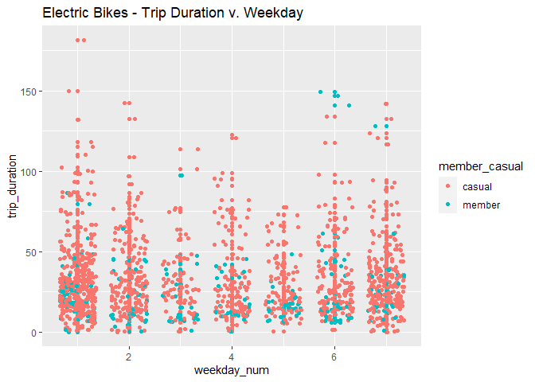

Classification Machine Learning Models
================
Michael Albers
2022-07-23

## Overview

-   Run a kernelized SVM model on a bike sharing data set

-   Implement two other classification models on same data set

-   Compare and contrast results of each classification model

## Data Set

Lyft Bikes and Scooters, LLC (“Bikeshare”) operates the City of
Chicago’s (“City”) Divvy bicycle sharing service
(<https://divvybikes.com>). Bikeshare and the City are committed to
supporting bicycling as an alternative transportation option. As part of
that commitment, the City permits Bikeshare to make certain Divvy system
data owned by the City (“Data”) available to the public.

License Agreement: <https://ride.divvybikes.com/data-license-agreement>

Download link: <https://divvy-tripdata.s3.amazonaws.com/index.html>

## Read and Inspect data set

The bike sharing data file for the month of May in 2021 will be the data
source. The dependent variable for the classification models is the
member_casual column. The classification models will try and predict
whether a bike customer is a member or a casual bike rider.

``` r
dd <- read.csv('data/202105-divvy-tripdata.csv')
```

``` r
glimpse(dd)
```

    ## Rows: 531,633
    ## Columns: 13
    ## $ ride_id            <chr> "C809ED75D6160B2A", "DD59FDCE0ACACAF3", "0AB83CB88C…
    ## $ rideable_type      <chr> "electric_bike", "electric_bike", "electric_bike", …
    ## $ started_at         <chr> "2021-05-30 11:58:15", "2021-05-30 11:29:14", "2021…
    ## $ ended_at           <chr> "2021-05-30 12:10:39", "2021-05-30 12:14:09", "2021…
    ## $ start_station_name <chr> "", "", "", "", "", "", "", "", "", "", "", "", "",…
    ## $ start_station_id   <chr> "", "", "", "", "", "", "", "", "", "", "", "", "",…
    ## $ end_station_name   <chr> "", "", "", "", "", "", "", "", "", "", "", "", "",…
    ## $ end_station_id     <chr> "", "", "", "", "", "", "", "", "", "", "", "", "",…
    ## $ start_lat          <dbl> 41.90000, 41.88000, 41.92000, 41.92000, 41.94000, 4…
    ## $ start_lng          <dbl> -87.63000, -87.62000, -87.70000, -87.70000, -87.690…
    ## $ end_lat            <dbl> 41.89000, 41.79000, 41.92000, 41.94000, 41.94000, 4…
    ## $ end_lng            <dbl> -87.61000, -87.58000, -87.70000, -87.69000, -87.700…
    ## $ member_casual      <chr> "casual", "casual", "casual", "casual", "casual", "…

### Filter on the busiest starting bike station

Since there are over 530,000 trips for the month of May 2021, the
classification models will be limited to the busiest starting bike
station for May of 2021

``` r
starting_and_end_stations <- dd %>% 
  filter(start_station_name != "" & end_station_name != "")
```

``` r
starting_and_end_stations %>% 
  group_by(start_station_id, start_station_name) %>% 
  summarize(number_trips = n()) %>% 
  arrange(desc(number_trips))
```

    ## `summarise()` has grouped output by 'start_station_id'. You can override using
    ## the `.groups` argument.

    ## # A tibble: 683 × 3
    ## # Groups:   start_station_id [682]
    ##    start_station_id start_station_name         number_trips
    ##    <chr>            <chr>                             <int>
    ##  1 13022            Streeter Dr & Grand Ave            9934
    ##  2 13300            Lake Shore Dr & Monroe St          5957
    ##  3 13008            Millennium Park                    4742
    ##  4 13042            Michigan Ave & Oak St              4645
    ##  5 LF-005           Lake Shore Dr & North Blvd         4484
    ##  6 TA1308000001     Theater on the Lake                3952
    ##  7 TA1308000050     Wells St & Concord Ln              3905
    ##  8 TA1307000039     Clark St & Elm St                  3716
    ##  9 TA1307000117     Wabash Ave & Grand Ave             3395
    ## 10 KA1504000135     Wells St & Elm St                  3324
    ## # … with 673 more rows
    ## # ℹ Use `print(n = ...)` to see more rows

``` r
streeter_station.df <- starting_and_end_stations %>% 
  filter(start_station_id == 13022)
```

``` r
glimpse(streeter_station.df)
```

    ## Rows: 9,934
    ## Columns: 13
    ## $ ride_id            <chr> "F11A33F23812E28B", "11905A9E1B6E87E7", "2984AE2655…
    ## $ rideable_type      <chr> "docked_bike", "classic_bike", "classic_bike", "cla…
    ## $ started_at         <chr> "2021-05-22 19:34:05", "2021-05-14 19:26:57", "2021…
    ## $ ended_at           <chr> "2021-05-22 21:02:54", "2021-05-14 19:55:08", "2021…
    ## $ start_station_name <chr> "Streeter Dr & Grand Ave", "Streeter Dr & Grand Ave…
    ## $ start_station_id   <chr> "13022", "13022", "13022", "13022", "13022", "13022…
    ## $ end_station_name   <chr> "Leavitt St & Division St", "Lincoln Ave & Fullerto…
    ## $ end_station_id     <chr> "658", "TA1309000058", "13338", "13338", "13338", "…
    ## $ start_lat          <dbl> 41.89228, 41.89228, 41.89228, 41.89228, 41.89228, 4…
    ## $ start_lng          <dbl> -87.61204, -87.61204, -87.61204, -87.61204, -87.612…
    ## $ end_lat            <dbl> 41.90300, 41.92591, 41.89691, 41.89691, 41.89691, 4…
    ## $ end_lng            <dbl> -87.68382, -87.64926, -87.62174, -87.62174, -87.621…
    ## $ member_casual      <chr> "casual", "member", "member", "member", "member", "…

``` r
streeter_station.df$rideable_type <- factor(streeter_station.df$rideable_type, levels = c("classic_bike", "docked_bike", "electric_bike"))
```

``` r
streeter_station.df$started_at <- ymd_hms(streeter_station.df$started_at)
```

``` r
streeter_station.df$ended_at <- ymd_hms(streeter_station.df$ended_at)
```

``` r
streeter_station.df$member_casual <- factor(streeter_station.df$member_casual, levels = c("casual", "member"))
```

``` r
glimpse(streeter_station.df)
```

    ## Rows: 9,934
    ## Columns: 13
    ## $ ride_id            <chr> "F11A33F23812E28B", "11905A9E1B6E87E7", "2984AE2655…
    ## $ rideable_type      <fct> docked_bike, classic_bike, classic_bike, classic_bi…
    ## $ started_at         <dttm> 2021-05-22 19:34:05, 2021-05-14 19:26:57, 2021-05-…
    ## $ ended_at           <dttm> 2021-05-22 21:02:54, 2021-05-14 19:55:08, 2021-05-…
    ## $ start_station_name <chr> "Streeter Dr & Grand Ave", "Streeter Dr & Grand Ave…
    ## $ start_station_id   <chr> "13022", "13022", "13022", "13022", "13022", "13022…
    ## $ end_station_name   <chr> "Leavitt St & Division St", "Lincoln Ave & Fullerto…
    ## $ end_station_id     <chr> "658", "TA1309000058", "13338", "13338", "13338", "…
    ## $ start_lat          <dbl> 41.89228, 41.89228, 41.89228, 41.89228, 41.89228, 4…
    ## $ start_lng          <dbl> -87.61204, -87.61204, -87.61204, -87.61204, -87.612…
    ## $ end_lat            <dbl> 41.90300, 41.92591, 41.89691, 41.89691, 41.89691, 4…
    ## $ end_lng            <dbl> -87.68382, -87.64926, -87.62174, -87.62174, -87.621…
    ## $ member_casual      <fct> casual, member, member, member, member, member, mem…

``` r
streeter_station.df %>% 
  tabyl(rideable_type, member_casual) %>% 
  adorn_totals("col")
```

    ##  rideable_type casual member Total
    ##   classic_bike   4402   1527  5929
    ##    docked_bike   2570      0  2570
    ##  electric_bike   1199    236  1435

The label column is member_casual which has two possible values (member
or casual).

## Pre-processing of data set

### One-hot encode the rideable_type column

``` r
dummy <- dummyVars("~ rideable_type", data = streeter_station.df, levelsOnly = TRUE)
```

``` r
dummy
```

    ## Dummy Variable Object
    ## 
    ## Formula: ~rideable_type
    ## <environment: 0x000002024fea28e0>
    ## 1 variables, 1 factors
    ## Factor variable names will be removed
    ## A less than full rank encoding is used

``` r
dummy.df <- data.frame(predict(dummy, newdata = streeter_station.df))
```

``` r
bike_trips.df <- cbind(streeter_station.df, dummy.df)
```

### Create new features

1.  **Week day number**: Day of week that the person took a bike trip

2.  **Start hour**: The hour of the day that the person started on bike
    trip

3.  **End hour**: The hour of the day that the person ended his/her bike
    trip

4.  **Trip duration**: Duration of bike trip in minutes, calculated as
    ended_at minus started_at

``` r
bike_trips.df$weekday_num <- wday(bike_trips.df$started_at)
```

``` r
bike_trips.df$start_hour <- as.numeric(format(as.POSIXct(bike_trips.df$started_at), format = "%H"))
```

``` r
bike_trips.df$end_hour <- as.numeric(format(as.POSIXct(bike_trips.df$ended_at), format = "%H"))
```

``` r
bike_trips.df$trip_duration <- as.numeric(difftime(bike_trips.df$ended_at, bike_trips.df$started_at, units = "mins"))
```

``` r
bike_trips.df <- subset(bike_trips.df,
            select = -c(start_station_id, start_station_name, start_lat, start_lng ))
```

``` r
glimpse(bike_trips.df)
```

    ## Rows: 9,934
    ## Columns: 16
    ## $ ride_id          <chr> "F11A33F23812E28B", "11905A9E1B6E87E7", "2984AE265510…
    ## $ rideable_type    <fct> docked_bike, classic_bike, classic_bike, classic_bike…
    ## $ started_at       <dttm> 2021-05-22 19:34:05, 2021-05-14 19:26:57, 2021-05-10…
    ## $ ended_at         <dttm> 2021-05-22 21:02:54, 2021-05-14 19:55:08, 2021-05-10…
    ## $ end_station_name <chr> "Leavitt St & Division St", "Lincoln Ave & Fullerton …
    ## $ end_station_id   <chr> "658", "TA1309000058", "13338", "13338", "13338", "13…
    ## $ end_lat          <dbl> 41.90300, 41.92591, 41.89691, 41.89691, 41.89691, 41.…
    ## $ end_lng          <dbl> -87.68382, -87.64926, -87.62174, -87.62174, -87.62174…
    ## $ member_casual    <fct> casual, member, member, member, member, member, membe…
    ## $ classic_bike     <dbl> 0, 1, 1, 1, 1, 1, 1, 0, 1, 0, 0, 0, 1, 1, 1, 1, 0, 0,…
    ## $ docked_bike      <dbl> 1, 0, 0, 0, 0, 0, 0, 1, 0, 1, 1, 1, 0, 0, 0, 0, 1, 1,…
    ## $ electric_bike    <dbl> 0, 0, 0, 0, 0, 0, 0, 0, 0, 0, 0, 0, 0, 0, 0, 0, 0, 0,…
    ## $ weekday_num      <dbl> 7, 6, 2, 2, 2, 4, 4, 5, 2, 1, 1, 1, 1, 2, 4, 4, 6, 6,…
    ## $ start_hour       <dbl> 19, 19, 8, 8, 13, 13, 8, 17, 8, 18, 18, 19, 15, 17, 1…
    ## $ end_hour         <dbl> 21, 19, 8, 8, 13, 13, 8, 17, 8, 20, 18, 20, 15, 18, 1…
    ## $ trip_duration    <dbl> 88.816667, 28.183333, 4.883333, 5.283333, 4.266667, 4…

``` r
summary(bike_trips.df)
```

    ##    ride_id                rideable_type    started_at                    
    ##  Length:9934        classic_bike :5929   Min.   :2021-05-01 01:10:26.00  
    ##  Class :character   docked_bike  :2570   1st Qu.:2021-05-13 08:31:50.50  
    ##  Mode  :character   electric_bike:1435   Median :2021-05-21 17:07:12.50  
    ##                                          Mean   :2021-05-18 23:49:37.05  
    ##                                          3rd Qu.:2021-05-26 15:43:00.50  
    ##                                          Max.   :2021-05-31 23:40:34.00  
    ##     ended_at                      end_station_name   end_station_id    
    ##  Min.   :2021-05-01 01:22:15.00   Length:9934        Length:9934       
    ##  1st Qu.:2021-05-13 08:50:42.50   Class :character   Class :character  
    ##  Median :2021-05-21 17:40:59.50   Mode  :character   Mode  :character  
    ##  Mean   :2021-05-19 00:29:06.95                                        
    ##  3rd Qu.:2021-05-26 16:13:58.75                                        
    ##  Max.   :2021-06-03 08:48:32.00                                        
    ##     end_lat         end_lng       member_casual  classic_bike   
    ##  Min.   :41.78   Min.   :-87.73   casual:8171   Min.   :0.0000  
    ##  1st Qu.:41.88   1st Qu.:-87.63   member:1763   1st Qu.:0.0000  
    ##  Median :41.89   Median :-87.62                 Median :1.0000  
    ##  Mean   :41.90   Mean   :-87.63                 Mean   :0.5968  
    ##  3rd Qu.:41.90   3rd Qu.:-87.62                 3rd Qu.:1.0000  
    ##  Max.   :42.05   Max.   :-87.58                 Max.   :1.0000  
    ##   docked_bike     electric_bike     weekday_num      start_hour   
    ##  Min.   :0.0000   Min.   :0.0000   Min.   :1.000   Min.   : 0.00  
    ##  1st Qu.:0.0000   1st Qu.:0.0000   1st Qu.:1.000   1st Qu.:13.00  
    ##  Median :0.0000   Median :0.0000   Median :4.000   Median :15.00  
    ##  Mean   :0.2587   Mean   :0.1445   Mean   :3.924   Mean   :15.29  
    ##  3rd Qu.:1.0000   3rd Qu.:0.0000   3rd Qu.:7.000   3rd Qu.:18.00  
    ##  Max.   :1.0000   Max.   :1.0000   Max.   :7.000   Max.   :23.00  
    ##     end_hour     trip_duration    
    ##  Min.   : 0.00   Min.   :   0.00  
    ##  1st Qu.:13.25   1st Qu.:  17.20  
    ##  Median :16.00   Median :  27.18  
    ##  Mean   :15.71   Mean   :  39.50  
    ##  3rd Qu.:18.00   3rd Qu.:  42.88  
    ##  Max.   :23.00   Max.   :4144.47

## Visualization

Plot Electric Bikes for Casual and Member classes

``` r
electric_bikes.df <- bike_trips.df %>% 
  filter(electric_bike == 1) %>% 
  subset(select = c(end_lat, end_lng, weekday_num, trip_duration, start_hour, end_hour, member_casual))
```

``` r
ggplot(data=electric_bikes.df, aes(x=end_lat, y=end_lng)) +
  geom_jitter() +
  geom_point(aes(color=member_casual)) +
  labs(title="Electric Bikes - Destination Coordinates")
```

<!-- -->

``` r
ggplot(data=electric_bikes.df, aes(x=weekday_num, y=trip_duration)) +
  geom_point(aes(color=member_casual)) +
  geom_jitter(aes(color=member_casual), width = 0.35) +
  labs(title="Electric Bikes - Trip Duration v. Weekday")
```

<!-- -->

``` r
ggplot(data=electric_bikes.df, aes(x=start_hour, y=end_hour)) +
  geom_point(aes(color=member_casual)) +
  facet_wrap(~member_casual) +
  geom_jitter(aes(color=member_casual), width = 2.5) +
  labs(title="Electric Bikes - Trip Starting v. Ending Hour")
```

<!-- -->

## Set seed for reproduceability

``` r
set.seed(42)
```

## Split Electric Bikes data into Training and Testing Sets

### Training data

``` r
train_index <- sample(1:nrow(electric_bikes.df), 0.75 * nrow(electric_bikes.df))
```

``` r
train_data <- electric_bikes.df[train_index, 1:6]
```

``` r
glimpse(train_data)
```

    ## Rows: 1,076
    ## Columns: 6
    ## $ end_lat       <dbl> 41.88126, 41.88170, 41.89413, 41.89473, 41.94008, 41.867…
    ## $ end_lng       <dbl> -87.63067, -87.64128, -87.62949, -87.61778, -87.64530, -…
    ## $ weekday_num   <dbl> 6, 1, 3, 5, 6, 1, 2, 3, 3, 1, 3, 3, 7, 2, 7, 2, 1, 2, 5,…
    ## $ trip_duration <dbl> 32.1666667, 35.9833333, 30.9166667, 56.2833333, 23.05000…
    ## $ start_hour    <dbl> 13, 11, 16, 11, 16, 18, 15, 12, 12, 21, 12, 14, 19, 15, …
    ## $ end_hour      <dbl> 13, 12, 17, 12, 17, 18, 15, 12, 13, 22, 13, 15, 19, 15, …

``` r
train_classes <- electric_bikes.df[train_index, 7]
```

``` r
train_classes %>% 
  tabyl() %>% 
  adorn_totals(c("row"))
```

    ##       .    n   percent
    ##  casual  899 0.8355019
    ##  member  177 0.1644981
    ##   Total 1076 1.0000000

### Test data

``` r
test_data <- electric_bikes.df[-train_index, 1:6]
```

``` r
glimpse(test_data)
```

    ## Rows: 359
    ## Columns: 6
    ## $ end_lat       <dbl> 41.86516, 41.88014, 41.87874, 41.93131, 41.88614, 41.896…
    ## $ end_lng       <dbl> -87.64710, -87.63528, -87.62969, -87.63877, -87.61627, -…
    ## $ weekday_num   <dbl> 1, 1, 5, 5, 7, 6, 6, 7, 7, 6, 1, 4, 7, 6, 4, 7, 2, 5, 6,…
    ## $ trip_duration <dbl> 21.566667, 62.466667, 25.850000, 20.033333, 15.300000, 1…
    ## $ start_hour    <dbl> 16, 21, 18, 19, 18, 8, 19, 17, 11, 17, 0, 19, 18, 17, 20…
    ## $ end_hour      <dbl> 16, 22, 18, 19, 18, 8, 22, 18, 11, 18, 0, 19, 19, 18, 21…

``` r
test_classes <- electric_bikes.df[-train_index, 7]
```

``` r
test_classes %>% 
  tabyl() %>% 
  adorn_totals(c("row"))
```

    ##       .   n   percent
    ##  casual 300 0.8356546
    ##  member  59 0.1643454
    ##   Total 359 1.0000000

## Classification Models

### Kernelized SVM

``` r
fold <- trainControl(method = "cv", number = 5)
```

``` r
param_grid <- expand.grid(sigma = c(0.05, 0.075, 0.1, 0.25, 0.5, 0.75, 0.9),
                              C = c(0.05, 0.075, 0.1, 0.25, 0.5, 0.75, 1.5))
```

``` r
svm.rbf.cv <- train(x=train_data, 
                    y=train_classes,
                    method = "svmRadial",
                    trControl = fold,
                    preProcess = c("center", "scale"),
                    tuneGrid = param_grid,
                    tuneLength = 5
                    )
```

``` r
print(svm.rbf.cv)
```

    ## Support Vector Machines with Radial Basis Function Kernel 
    ## 
    ## 1076 samples
    ##    6 predictor
    ##    2 classes: 'casual', 'member' 
    ## 
    ## Pre-processing: centered (6), scaled (6) 
    ## Resampling: Cross-Validated (5 fold) 
    ## Summary of sample sizes: 860, 861, 861, 860, 862 
    ## Resampling results across tuning parameters:
    ## 
    ##   sigma  C      Accuracy   Kappa       
    ##   0.050  0.050  0.8355068   0.000000000
    ##   0.050  0.075  0.8355068   0.000000000
    ##   0.050  0.100  0.8355068   0.000000000
    ##   0.050  0.250  0.8355068   0.000000000
    ##   0.050  0.500  0.8355068   0.000000000
    ##   0.050  0.750  0.8327290  -0.005263158
    ##   0.050  1.500  0.8355068   0.060325620
    ##   0.075  0.050  0.8355068   0.000000000
    ##   0.075  0.075  0.8355068   0.000000000
    ##   0.075  0.100  0.8355068   0.000000000
    ##   0.075  0.250  0.8355068   0.000000000
    ##   0.075  0.500  0.8336549   0.010869901
    ##   0.075  0.750  0.8373672   0.064521885
    ##   0.075  1.500  0.8513165   0.202505743
    ##   0.100  0.050  0.8355068   0.000000000
    ##   0.100  0.075  0.8355068   0.000000000
    ##   0.100  0.100  0.8355068   0.000000000
    ##   0.100  0.250  0.8355068   0.000000000
    ##   0.100  0.500  0.8336592   0.030642509
    ##   0.100  0.750  0.8457438   0.142768391
    ##   0.100  1.500  0.8531684   0.226827209
    ##   0.250  0.050  0.8355068   0.000000000
    ##   0.250  0.075  0.8355068   0.000000000
    ##   0.250  0.100  0.8355068   0.000000000
    ##   0.250  0.250  0.8410926   0.068958138
    ##   0.250  0.500  0.8522425   0.186670548
    ##   0.250  0.750  0.8568938   0.225279224
    ##   0.250  1.500  0.8596628   0.269951479
    ##   0.500  0.050  0.8355068   0.000000000
    ##   0.500  0.075  0.8355068   0.000000000
    ##   0.500  0.100  0.8355068   0.000000000
    ##   0.500  0.250  0.8448049   0.103497743
    ##   0.500  0.500  0.8531857   0.194347153
    ##   0.500  0.750  0.8587499   0.234814434
    ##   0.500  1.500  0.8624536   0.314624169
    ##   0.750  0.050  0.8355068   0.000000000
    ##   0.750  0.075  0.8355068   0.000000000
    ##   0.750  0.100  0.8355068   0.000000000
    ##   0.750  0.250  0.8410839   0.069136855
    ##   0.750  0.500  0.8559635   0.210716201
    ##   0.750  0.750  0.8615364   0.264178527
    ##   0.750  1.500  0.8624925   0.323460056
    ##   0.900  0.050  0.8355068   0.000000000
    ##   0.900  0.075  0.8355068   0.000000000
    ##   0.900  0.100  0.8355068   0.000000000
    ##   0.900  0.250  0.8401580   0.060370622
    ##   0.900  0.500  0.8559722   0.204774832
    ##   0.900  0.750  0.8587543   0.251587681
    ##   0.900  1.500  0.8634228   0.330454066
    ## 
    ## Accuracy was used to select the optimal model using the largest value.
    ## The final values used for the model were sigma = 0.9 and C = 1.5.

``` r
plot(svm.rbf.cv)
```

<!-- -->

#### Predict classes using SVM Kernelized model

``` r
svm_pred <- predict(svm.rbf.cv, test_data)
```

``` r
confusionMatrix(svm_pred, test_classes, dnn = c("Prediction", "Actual"))
```

    ## Confusion Matrix and Statistics
    ## 
    ##           Actual
    ## Prediction casual member
    ##     casual    291     45
    ##     member      9     14
    ##                                           
    ##                Accuracy : 0.8496          
    ##                  95% CI : (0.8083, 0.8849)
    ##     No Information Rate : 0.8357          
    ##     P-Value [Acc > NIR] : 0.2639          
    ##                                           
    ##                   Kappa : 0.2746          
    ##                                           
    ##  Mcnemar's Test P-Value : 1.908e-06       
    ##                                           
    ##             Sensitivity : 0.9700          
    ##             Specificity : 0.2373          
    ##          Pos Pred Value : 0.8661          
    ##          Neg Pred Value : 0.6087          
    ##              Prevalence : 0.8357          
    ##          Detection Rate : 0.8106          
    ##    Detection Prevalence : 0.9359          
    ##       Balanced Accuracy : 0.6036          
    ##                                           
    ##        'Positive' Class : casual          
    ## 

### Decision Tree

Perform cross-validation on training data using CART decision trees

``` r
param_grid.cart <- expand.grid(cp = c(0, 0.01, 0.02, 0.25, 0.3, 0.5, 0.75, 0.9))
```

``` r
cart.cv <- train(x=train_data, 
                 y=train_classes,
                 method = "rpart",
                 trControl = fold,
                 tuneGrid = param_grid.cart,
                 tuneLength = 5)
```

``` r
print(cart.cv)
```

    ## CART 
    ## 
    ## 1076 samples
    ##    6 predictor
    ##    2 classes: 'casual', 'member' 
    ## 
    ## No pre-processing
    ## Resampling: Cross-Validated (5 fold) 
    ## Summary of sample sizes: 860, 862, 860, 861, 861 
    ## Resampling results across tuning parameters:
    ## 
    ##   cp    Accuracy   Kappa    
    ##   0.00  0.8261740  0.2897951
    ##   0.01  0.8447961  0.2868429
    ##   0.02  0.8410838  0.2286731
    ##   0.25  0.8355068  0.0000000
    ##   0.30  0.8355068  0.0000000
    ##   0.50  0.8355068  0.0000000
    ##   0.75  0.8355068  0.0000000
    ##   0.90  0.8355068  0.0000000
    ## 
    ## Accuracy was used to select the optimal model using the largest value.
    ## The final value used for the model was cp = 0.01.

``` r
plot(cart.cv)
```

<!-- -->

#### Predict classes using Decision Tree model

``` r
dtree_pred <- predict(cart.cv, test_data)
```

``` r
confusionMatrix(dtree_pred, test_classes, dnn = c("Prediction", "Actual"))
```

    ## Confusion Matrix and Statistics
    ## 
    ##           Actual
    ## Prediction casual member
    ##     casual    293     44
    ##     member      7     15
    ##                                           
    ##                Accuracy : 0.8579          
    ##                  95% CI : (0.8175, 0.8924)
    ##     No Information Rate : 0.8357          
    ##     P-Value [Acc > NIR] : 0.1421          
    ##                                           
    ##                   Kappa : 0.3087          
    ##                                           
    ##  Mcnemar's Test P-Value : 4.631e-07       
    ##                                           
    ##             Sensitivity : 0.9767          
    ##             Specificity : 0.2542          
    ##          Pos Pred Value : 0.8694          
    ##          Neg Pred Value : 0.6818          
    ##              Prevalence : 0.8357          
    ##          Detection Rate : 0.8162          
    ##    Detection Prevalence : 0.9387          
    ##       Balanced Accuracy : 0.6155          
    ##                                           
    ##        'Positive' Class : casual          
    ## 

### k-NN (k-Nearest Neighbors)

``` r
folds.knn <- createFolds(electric_bikes.df[,7], k=5)
```

``` r
sapply(folds.knn, length)
```

    ## Fold1 Fold2 Fold3 Fold4 Fold5 
    ##   287   287   286   287   288

``` r
for (i in 1:5) {
  knn.f <- folds.knn[[i]]
  num_items.f <- length(knn.f)
  split <- round(num_items.f * .75)
  
  knn.train <- electric_bikes.df[knn.f[1:split], c("end_lat","end_lng","weekday_num","trip_duration","start_hour","end_hour")]
  knn.train.labels <- electric_bikes.df[knn.f[1:split], c("member_casual")]
  
  knn.test <- electric_bikes.df[knn.f[(split+1):num_items.f], 
                                c("end_lat","end_lng","weekday_num","trip_duration","start_hour","end_hour")]
  knn.test.labels <- electric_bikes.df[knn.f[(split+1):num_items.f], c("member_casual")]
  
  p <- knn(train = knn.train, test = knn.test, cl = knn.train.labels, k = 3)
  cat(paste("fold number: ", i, "accuracy: ", mean(p == knn.test.labels)), sep = "\n\n")
  
  print(table(knn.test.labels, p, dnn=c("Actual", "Predicted")))
  
}
```

    ## fold number:  1 accuracy:  0.833333333333333
    ##         Predicted
    ## Actual   casual member
    ##   casual     57      4
    ##   member      8      3
    ## fold number:  2 accuracy:  0.861111111111111
    ##         Predicted
    ## Actual   casual member
    ##   casual     61      0
    ##   member     10      1
    ## fold number:  3 accuracy:  0.861111111111111
    ##         Predicted
    ## Actual   casual member
    ##   casual     61      3
    ##   member      7      1
    ## fold number:  4 accuracy:  0.819444444444444
    ##         Predicted
    ## Actual   casual member
    ##   casual     56      5
    ##   member      8      3
    ## fold number:  5 accuracy:  0.763888888888889
    ##         Predicted
    ## Actual   casual member
    ##   casual     55      3
    ##   member     14      0

## Summary

-   The Kernel SVM, Decision Tree, and k-Nearest Neighbors models had
    similar accuracy scores of 86%

-   All three models had low Specificity scores which is the score of
    predicting the negative class which was “member”. This was probably
    due to the fact that the data set had far more casual bike riders
    than members

-   The k-NN model had the lowest prediction score for member bike
    riders

-   All three models had very high Sensitivity scores (above 95%) which
    was the prediction scores for casual bike riders
